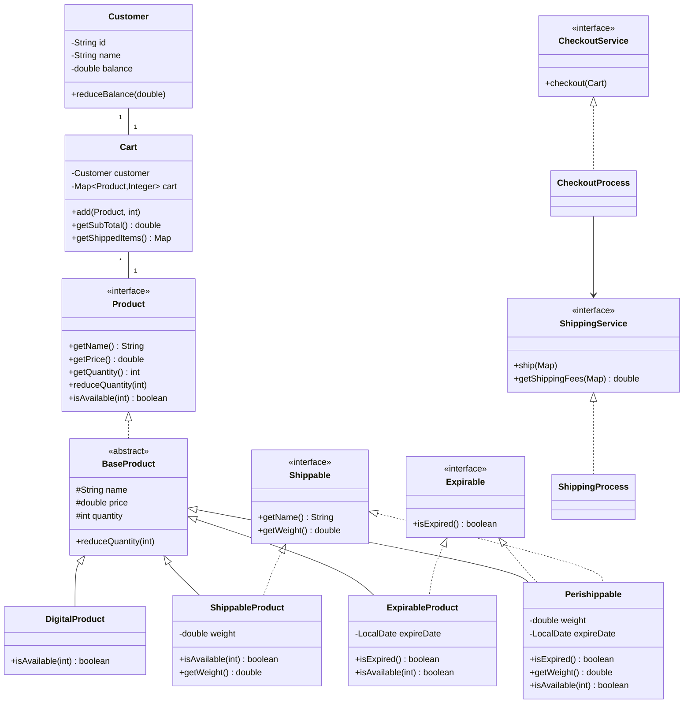

# 🛒 E-Commerce System


A robust, Java-based e-commerce platform implementing advanced object-oriented design principles for seamless product management, shopping experiences, and order processing with integrated checkout and shipping services.

## ✨ Key Features

- **🏷️ Advanced Product Management**
  - Multiple product types (Digital, Shippable, Expirable, Perishable-Shippable)
  - Automatic expiration handling for perishable items
  - Weight tracking for shippable products
  - Real-time availability checking

- **🛒 Intelligent Shopping Cart**
  - Dynamic quantity management with availability validation
  - Automatic separation of shippable vs digital items
  - Customer-specific cart association
  - Subtotal calculation with shipping integration

- **💳 Streamlined Checkout Process**
  - Integrated payment processing with balance validation
  - Automated inventory reduction
  - Comprehensive receipt generation
  - Exception handling for insufficient funds/stock

- **📦 Smart Shipping System**
  - Weight-based shipping calculations
  - Automatic shipment notifications
  - Conditional shipping fees (free for digital-only orders)
  - Detailed package weight tracking

- **👤 Customer Management**
  - Unique customer ID generation
  - Balance tracking and validation
  - Secure transaction processing

## 🏗️ Architecture Overview



## 📂 Project Structure

```
ecommerce-system/
├── src/
│   ├── models/
│   │   ├── cart/
│   │   │   └── Cart.java                    # Shopping cart management
│   │   ├── customer/
│   │   │   └── Customer.java                # Customer information & balance
│   │   └── products/
│   │       ├── impl/
│   │       │   ├── DigitalProduct.java      # Non-physical products
│   │       │   ├── ExpirableProduct.java    # Products with expiry dates
│   │       │   ├── Perishippable.java       # Expirable + Shippable products
│   │       │   └── ShippableProduct.java    # Physical products with weight
│   │       ├── BaseProduct.java             # Abstract base class
│   │       ├── Expirable.java               # Interface for expirable products
│   │       ├── Product.java                 # Base product interface
│   │       └── Shippable.java               # Interface for shippable products
│   ├── services/
│   │   ├── impl/
│   │   │   ├── CheckoutProcess.java         # Checkout implementation
│   │   │   └── ShippingProcess.java         # Shipping implementation
│   │   ├── CheckoutService.java             # Checkout service interface
│   │   └── ShippingService.java             # Shipping service interface
│   └── Main.java                            # Application entry point
```


## Applied SOLID Principles:

- **Single Responsibility**: Each class has one specific purpose (Cart handles cart operations, Customer handles customer data)
- **Open/Closed**: Product hierarchy is open for extension (new product types) but closed for modification
- **Liskov Substitution**: All product subtypes can be used interchangeably through Product interface
- **Interface Segregation**: Separate interfaces (Expirable, Shippable) for specific behaviors
- **Dependency Inversion**: CheckoutProcess depends on ShippingService abstraction, not concrete implementation

## 💻 Usage Example

```java
// Create products with different characteristics
LocalDate cheeseExpireDate = LocalDate.of(2025, 10, 30);
LocalDate biscuitsExpireDate = LocalDate.of(2025, 12, 5);

Product cheese = new Perishippable("Cheese", 100, 50, 200, cheeseExpireDate);
Product biscuits = new Perishippable("Biscuits", 150, 20, 700, biscuitsExpireDate);
Product tv = new ShippableProduct("TV", 7000, 10, 5000);
Product scratchCard = new DigitalProduct("Scratch Card", 50, 200);

// Create customer with initial balance
Customer customer = new Customer("Mohamed", 50000);
Cart cart = new Cart(customer);

// Initialize checkout service with shipping
CheckoutService checkoutService = new CheckoutProcess(new ShippingProcess());

try {
    // Add products to cart
    cart.add(cheese, 2);
    cart.add(tv, 3);
    cart.add(scratchCard, 1);
    cart.add(biscuits, 1);
    
    // Process checkout
    checkoutService.checkout(cart);
    
} catch (IllegalArgumentException e) {
    System.out.println("Error: " + e.getMessage());
} catch (IllegalStateException e) {
    System.out.println("Checkout Failed: " + e.getMessage());
}
```

## 🔄 System Flow

```
┌─────────────┐     ┌─────────────┐     ┌─────────────┐     ┌─────────────┐     ┌─────────────┐
│  Customer   │────>│    Cart     │────>│  Checkout   │────>│  Shipping   │────>│   Receipt   │
│ Management  │     │ Management  │     │  Process    │     │  Process    │     │ Generation  │
└─────────────┘     └─────────────┘     └─────────────┘     └─────────────┘     └─────────────┘
       │                    │                    │                    │                    │
       ▼                    ▼                    ▼                    ▼                    ▼
┌─────────────┐     ┌─────────────┐     ┌─────────────┐     ┌─────────────┐     ┌─────────────┐
│ Balance     │     │ Availability│     │ Payment     │     │ Shipment    │     │ Inventory   │
│ Validation  │     │ Checking    │     │ Processing  │     │ Notification│     │ Update      │
└─────────────┘     └─────────────┘     └─────────────┘     └─────────────┘     └─────────────┘
```

## 🧪 Sample Output

```
2x cheese 200.0
3x TV 21000.0
1x scratchCard 50.0
1x Biscuits 150.0
----------------------
Subtotal 21400.0
Shipping 30.0
Amount 21430.0
** Shipment notice **
2x cheese 400.0g
1x Biscuits 700.0g
3x TV 15000.0g
Total package weight 16.1kg
```

## 🔧 Key Features Implementation

### Product Types:
- **DigitalProduct**: No shipping required, unlimited availability
- **ShippableProduct**: Physical items with weight-based shipping
- **ExpirableProduct**: Time-sensitive items with expiration validation
- **Perishippable**: Combines expirable and shippable characteristics

### Smart Validation:
- Expiration date checking before adding to cart
- Stock availability validation
- Customer balance verification
- Empty cart prevention

### Shipping Logic:
- Automatic detection of shippable items
- Weight-based shipping calculations
- Conditional shipping fees (free for digital-only orders)
- Detailed shipment tracking

## 📝 Contributing

Contributions are welcome! Please feel free to submit a Pull Request.

## 📜 License

This project is licensed under the MIT License - see the LICENSE file for details.

---

<div align="center">
  <b>Built with ☕ and OOP principles</b>
</div>
